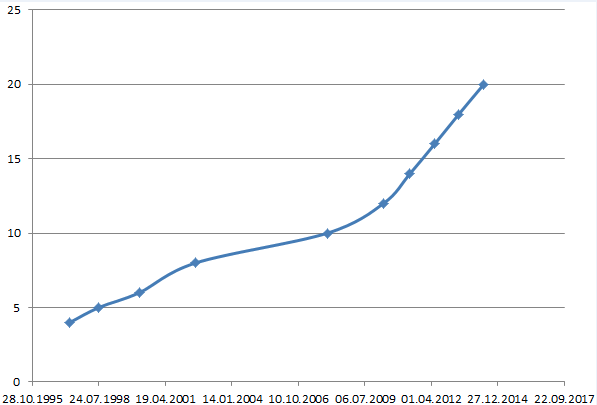

class: center, middle

# Perl Now

---

# Немного истории

Автор — Ларри Уол (Larry Wall).

Создан в 1987 году.



---

# Работа

* Booking.com
* CPanel
* Mail.ru Group
* Рамблер
* Яндекс
* RU-CENTER Group
* Мастерхост
* ...

---

# PCRE

```perl
/8 \(\d\d\d\) \d\d\d-\d\d-\d\d/;
```

```perl
my $test = "24+30=54";

$test =~ s{
  (\d+)
  ([-+*/])
  (\d+)
  =
  (\d+)
}{$4 = $3 $2 $1}x;

print $test; # 54 = 30 + 24
```

---

# PCRE — quiz

`/./`

`/[a-z]/`

`/[-az]/`

`/(vadim)/`

`/(?:vadim)/`

`/^vadim|katya$/`

`/Vadim(?! Pushtaev)/`

---

# CPAN

Comprehensive Perl Archive Network

* 138 649 модулей
* 11 749 авторов
* 253 зеркала


* metacpan.org
* search.cpan.org

---

# Moose

ООП-библиотека.

```perl
package Person;

use Moose;

has first_name => (
  is  => 'rw',
  isa => 'Str',
);

has last_name => (
  is  => 'rw',
  isa => 'Str',
);
```

```perl
Person->new(
  first_name => 'Vadim',
  last_name  => 'Pushtaev',
);
```

---

# Moose — наследование

```perl
package User;

use Moose;

extends 'Person';

has password => (
  is => 'ro',
  isa => 'Str',
);
```

---

# Moose — инициализация
### BUILD

```perl
has age      => (is => 'ro', isa => 'Int', required => 1); 
has is_adult => (is => 'ro', isa => 'Bool');

sub BUILD {
  my ($self) = @_;
  
  $self->is_adult($self->age >= 18);
  
  return;
}
```

---

# Moose — инициализация
### default

```perl
has age      => (is => 'ro', isa => 'Int', required => 1); 
has is_adult => (
  is => 'ro',
  isa => 'Bool',
  lazy => 1,
  default => sub {
    my ($self) = @_;
    return $self->age >= 18;
  }
);
```

---

# Moose — инициализация
### builder

```perl
has age      => (is => 'ro', isa => 'Int', required => 1);
has is_adult => (
  is => 'ro', isa => 'Bool',
  lazy => 1,  builder => '_build_is_adult',
);

sub _build_is_adult {
  my ($self) = @_;
  return $self->age >= 18;
}
```

```perl
package SuperMan;
extends 'Person';
sub _build_is_adult { return 1; }
```

---

# Moose — миксины

```perl
with 'Role::HasPassword';
```

```perl
package Role::HasPassword;
use Moose::Role;
use Some::Digest;

has password => (
  is => 'ro',
  isa => 'Str',
);

sub password_digest { 
  my ($self) = @_;
 
  return Some::Digest->new($self->password);
}
```

---

# Moose — делегирование

```perl
has doc => (
  is      => 'ro',
  isa     => 'Item',
  handles => [qw(read write size)],
);
```

```perl
has last_login => (
  is      => 'rw',
  isa     => 'DateTime',
  handles => { 'date_of_last_login' => 'date' },
);
```

---

# Moose — и т. д.

```perl
before 'is_adult' => sub { shift->recalculate_age }
```

```perl
subtype 'ModernDateTime'
  => as 'DateTime'
  => where { $_->year() >= 1980 }
  => message { 'The date you provided is not modern enough' };

has 'valid_dates' => (
  is  => 'ro',
  isa => 'ArrayRef[DateTime]',
);
```

```perl
package Config;
use MooseX::Singleton; # instead of Moose
has 'cache_dir' => ( ... );
```

---

# Moose — аналоги

* Moose
* Mouse
* Moo
* Mo
* M

---

# DBIx::Class

```perl
# SELECT * FROM user WHERE age >= 18
my @adults = $schema->resultset('User')->search({
  age => { '>=' => 18 },
});

foreach my $adult (@adults) {
  # UPDATE user SET fired = NOW() WHERE id = ...
  $adult->update({
    fired => \'NOW()',
  });
  
  $adult->cry();
}
```
---

# DBIx::Class — схема

```perl
__PACKAGE__->table('user_ip');

__PACKAGE__->add_columns(
  'user_id',
  { data_type => 'integer', is_foreign_key => 1, is_nullable => 0 },
  'ip',
  { data_type => 'varchar', is_nullable => 0, size => 128 },
);

__PACKAGE__->set_primary_key('user_id', 'ip');

__PACKAGE__->belongs_to(
  'user',
  'Schema::Result::User',
  { user_id => 'user_id' },
  { is_deferrable => 1, on_delete => 'CASCADE', on_update => 'CASCADE' },
);

```

---

# DBIx::Class — связи

```perl
# SELECT * FROM user WHERE id = 81858
my $user = $schema->resultset('User')->find(81858);

my $free_services = $user->accounts->search_related('service', {
  status => {'<>' => $DELETED_STATUS},
  price  => 0,
});
```

---

# DBIx::Class — поиск

```perl
my $man = $schema->resultset('User')->search(
  {
    'name'     => 'Вася',
    'cat.name' => 'Барсик',
    'dog.name' => 'Бобик',
  },
  {
    join => ['cat', 'dog'],
  }
);
```

---

# DBIx::Class — создание

```perl
$person_rs->create({
  name  => 'Vadim Pushtaev',
  email => 'vadim@pushtaev.ru',
});
```

```perl
$artist_rs->create({
  artistid => 4, name => 'Rage', cds => [
    { title => 'Black in Mind', year => 1995 },
    { title => 'XIII',          year => 1998 },
    { title => '21',            year => 2012 },
  ],
});
```

---

# DBIx::Class — изменение

```perl
$schema->resultset('User')->find(81858)->update({
  name => 'Vadim',
});
```

```perl
$schema->resultset('Cd')->search({
  title => 'ReLoad',
})->update_all({
  year => 1997,
});
```

---

# AnyEvent

```perl
use AnyEvent;

print "enter your name> ";

my $name;

my $wait_for_input = AnyEvent->io(
  fh   => \*STDIN,
  poll => 'r',
  cb   => sub {
     $name = <STDIN>;
  }
);
```

---

# AnyEvent — condvars

```perl
my $name_ready = AnyEvent->condvar;

my $wait_for_input = AnyEvent->io(
  fh   => \*STDIN,
  poll => "r",
  cb   => sub {
     $name = <STDIN>;
     $name_ready->send($name);
  }
);

#...

my $name = $name_ready->recv;

```

---

# AnyEvent — источники

```perl
my $w = AnyEvent => timer(
  after => 1.5,
  cb    => {'...'},
);
```

```perl
# POSIX signal
my $w = AnyEvent->signal(
  signal => "TERM",
  cb     => sub {'...'),
}
```

---

# Test::Class

```perl
package Test::Utils;
use base 'Test::Class';
use Utils qw(cube);

sub test_cube : Test(2)
{
  my ($self) = @_;
  
  is(cube(-2), -8, 'negative');
  is(cube(2),   8, 'positive');
  
  return;
}
```

---

# Test::Deep

```perl
cmp_bag(
  [7, 'Fred', {vadim => 'pushtaev'}],
  ['Fred', {vadim => 'pushtaev'}, 7],
  'OK'
);
```

```perl
cmp_deeply(
  $obj,
  methods(name => 'John', ['favourite', 'food'] => 'taco')
);
# $obj->name eq 'Join';
# $obj->favourite->food eq 'taco';
```

---

# Test::MockObject

```perl
use Test::MockObject;

my $mock = Test::MockObject->new();
$mock->set_true('somemethod');
ok( $mock->somemethod() );

$mock
  ->set_true('Deutsch')
  ->set_false('English')
  ->set_series('numbers', 'Eins', 'Zwei', 'Drei');
```

---

# Test::DBIx::Class

DBIx::Class::Schema::PopulateMore

```yaml
- Gender:
  fields: label   
  data:
    female: female
    male: male
- Person:
  fields:
    - name
    - age
    - gender
  data:
    jane:
      - jane
      - 40
      - '!Index:Gender.female'
    john:
      - john
      - 38
      - '!Index:Gender.male'
```

---

# Perl::Critic

```perl
my $max_cache_size = 42;
```

```perl
my $maxCacheSize;
```

```perl
$max_cache_size++ if condition();
```

```perl
$obj->_some_method();
```

```perl
my @names = (
  'Pushtaev Vadim',
  'Pushtaeva Ekaterina'
);
```

---

# use strict;

```perl
Perl::Critic::Policy::TestingAndDebugging::RequireUseStrict
```

```perl
perl5i
```

```perl
uni::perl
```

```perl
Modern::Perl
```

```perl
common::sense
```

---

# TIMTOWTDI

```perl
unless ($service->free) {
  take_money($service->cost);
}
```

```perl
$employee->fire() if $employee->score < 0;
```

```perl
$storage->add_user($_) foreach @users;
```

```perl
My::Storage->copy($from => $to);
```

```perl
has 'field' => (
  is => 'ro',
  # ...
);
```
---

class: center, middle

# .ss[Modern Perl]
# Perl Now
